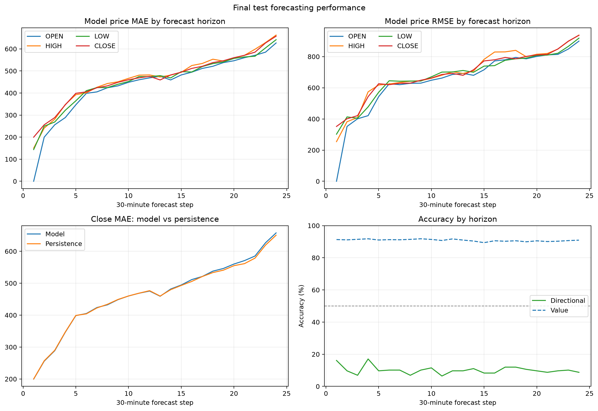

# BTC/USDT BiLSTM Seq2Seq Forecasting — Experiment 1

[](https://github.com/BihanRay28/lstm-seq2seq-bahdanau-ohlcv-forecasting/actions/workflows/tests.yml)

A reproducible first experiment for forecasting the next **24 BTC/USDT 30-minute OHLCV candles** from the preceding **48 candles**. The network combines a two-layer bidirectional LSTM encoder, Bahdanau attention, and a two-layer autoregressive LSTM decoder.

This repository includes the implementation, tests, the exact input dataset, and a curated copy of the completed run's metrics and plots. It is a research experiment, not trading or financial advice.

## Experiment design

- **Input:** 48 candles (24 hours), transformed into five stationary-style channels.
- **Output:** 24 autoregressive candles (12 hours): open, high, low, close, and volume.
- **Model:** 2-layer BiLSTM encoder (128 units/direction), additive attention (128 units), 2-layer LSTM decoder (128 units), dropout 0.2.
- **Optimization:** Smooth L1 loss, weight decay of `1e-4`, learning rate `1e-3`, batch size 64, gradient clipping at 1.0.
- **Selection:** five expanding-window walk-forward folds with early stopping (patience 10); the median best epoch is used for final development-set training.
- **Evaluation:** the final 10% chronological holdout is touched once; evaluation windows are non-overlapping (stride 24).
- **Seed:** 42.

The included dataset contains **52,560 uninterrupted 30-minute candles**, from `2023-09-14 13:30:00` through `2026-09-13 13:00:00`. The split yields 47,304 development rows, 5,256 test rows, and 217 test windows.

## Completed run

Run ID: `20260915_014630_035336_full`

Fold-best epochs were `[1, 1, 2, 1, 2]`; their median selected **1 final epoch**. All five folds then continued through the early-stopping patience window, for 11–12 epochs each. The final model was evaluated on 217 held-out windows.

| Field | Model MAE | Persistence MAE | MAE change | Model RMSE | Persistence RMSE | RMSE change |
|---|---:|---:|---:|---:|---:|---:|
| Open | 437.40 | 467.32 | +6.40% | 678.53 | 712.87 | +4.82% |
| High | 465.98 | 460.15 | -1.27% | 711.70 | 704.95 | -0.96% |
| Low | 454.70 | 469.38 | +3.13% | 694.51 | 712.22 | +2.49% |
| Close | 464.79 | 462.76 | -0.44% | 704.95 | 701.68 | -0.47% |
| Volume | 178.17 | 240.46 | +25.91% | 358.42 | 420.14 | +14.69% |

Positive changes mean lower error than the persistence baseline. Averaged across the four price fields, the model improved MAE by **1.97%** and RMSE by **1.48%**, but it was slightly worse for the most decision-relevant close-price error.

Additional reported results:

- Candle-direction accuracy: **10.14%**.
- 12-hour endpoint direction accuracy: **48.39%**.
- Macro clipped relative-closeness score: **90.87%**.
- Predicted candle classes were heavily collapsed toward doji: 5,037 of 5,208 predicted candles.

The high relative-closeness score should not be read as directional skill: BTC price levels are large relative to typical absolute errors, while direction accuracy is poor. This run is a useful baseline, but the evidence does **not** support production or trading use. Likely next work is to address class collapse and compare against stronger sequence and market baselines.



The close-price curve is nearly indistinguishable from persistence, while directional accuracy remains far below 50% across the horizon.

## Reproduce locally

Python 3.11 or newer is required.

```bash
python -m venv .venv
# Windows: .venv\Scripts\activate
# macOS/Linux: source .venv/bin/activate
python -m pip install --upgrade pip
python -m pip install -e ".[test]"
python -m ohlcv_forecaster.cli validate-data
python -m pytest -q
```

Run the bounded CPU smoke test:

```bash
python -m ohlcv_forecaster.cli smoke --device cpu
```

Run the complete five-fold experiment (CUDA is selected automatically when available):

```bash
python -m ohlcv_forecaster.cli train --mode full
```

Every new run is written to a timestamped directory under `outputs/`, which is intentionally ignored by Git. Promote only reviewed artifacts into `results/`.

## Repository layout

```text
data/                 Exact 30-minute BTC/USDT dataset and provenance note
results/exp1/         Curated metrics, histories, scalers, and figures
src_exp1/             Installable Python package
tests/                Data, model, training, and evaluation tests
pyproject.toml        Dependencies, packaging, CLI, and test configuration
```

## Artifact verification

- The test suite contains 26 tests covering dataset integrity and split isolation, feature reconstruction, model and attention shapes, teacher forcing, physical OHLC constraints, metrics, and persistence.
- All arrays in the archived prediction bundle were finite when audited.
- Attention weights had a maximum row-sum error of `2.38e-7` from 1.0.
- Dataset SHA-256: `6c20e9718cc91ee95732226af876c21ca0d7767f612f5056cdce633fc83cde62`.
- Checkpoints and the 1.25 MB prediction bundle are retained locally but omitted from GitHub; the repository contains the human-reviewable metrics and plots needed to assess this experiment.

## Limitations

- Results come from one market, one bar interval, one chronological split, and one random seed.
- Persistence is necessary but not a sufficient benchmark; stronger statistical and neural baselines remain to be added.
- Hyperparameters were not exhaustively tuned.
- Price and volume regime shifts can invalidate historical performance.
- “Value accuracy” is a custom clipped relative-closeness score, not a standard forecasting metric.
- No fees, slippage, latency, position sizing, or backtest is represented.

## Data note

The repository preserves the supplied Binance BTC/USDT 30-minute OHLCV CSV so the recorded split and tests remain reproducible. See [`data/README.md`](data/README.md) for schema and integrity details.
